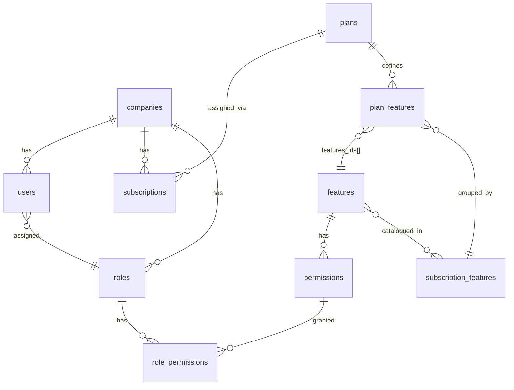

# Qubefini Multi-Tenant And Plans Implementation

# Table Model Definitions

## Companies

```
model companies {
  id                String    @id @default(uuid())
  company_name      String    @unique
  company_code      String
  country           String?
  address           String?
  contact           String?
  start_date        DateTime?
  end_date          DateTime?
  owner_emails      String[]
  logo_path         String?
  is_deleted        Boolean   @default(false)
  is_system_company Boolean   @default(false)
  created_at        DateTime  @default(now())
  updated_at        DateTime  @updatedAt
  created_by        String?
  updated_by        String?

  users                   users[]
  invites                 invites[]
  subscriptions           subscriptions[]
  roles                   roles[]

  @@index([company_name])
  @@index([is_deleted])
}
```

## Users

```
model users {
  id         String  @id @default(uuid())
  company_id String
  first_name String
  last_name  String
  email      String
  username   String
  password   String
  role_id    String?

  created_at DateTime @default(now())
  updated_at DateTime @default(now())

  company                    companies                 @relation(fields: [company_id], references: [id])
  role                       roles?                    @relation(fields: [role_id], references: [id])
  invites                    invites[]                 @relation("InvitedUsers")

  @@unique([company_id, email]) // Email unique per company
  @@unique([company_id, username]) // Username unique per company
  @@index([email]) // For login/signup lookups
  @@index([username]) // For username lookups
  @@index([company_id]) // For company-based lookups
}
```

## Invites

```
// Might not be needed, use according to implementation
model invites {
  id         String   @id @default(uuid())
  company_id String
  role_id    String?
  email      String
  name       String
  role       String
  token      String   @unique
  status     String   @default("pending") // 'pending', 'accepted', 'expired'
  created_at DateTime @default(now())
  expires_at DateTime
  invited_by String?

  // Add relationship to inviting admin
  company       companies @relation(fields: [company_id], references: [id])
  assignedRole  roles?    @relation(fields: [role_id], references: [id], onDelete: SetNull)
  invitedByUser users?    @relation("InvitedUsers", fields: [invited_by], references: [id], onDelete: SetNull)

  @@unique([company_id, email]) // Email unique per company (same email can be invited to different companies)
  @@index([email]) // Add index for faster lookups by email
  @@index([token]) // Add index for token validation
  @@index([status]) // Add index for filtering pending invites
  @@index([expires_at]) // Add index for checking expired invites
  @@index([company_id]) // Add index for company-based lookups
}
```

## Subscriptions

```
model subscriptions {
  id                       String    @id @default(uuid())
  company_id               String
  plan_id                  String
  auto_renew               Boolean   @default(false)
  charge_at                DateTime?
  current_end              DateTime?
  start_date               DateTime
  end_date                 DateTime
  ended_at                 DateTime?
  razorpay_subscription_id String?
  status                   String
  users_limit              Int?
  plan                     plans     @relation(fields: [plan_id], references: [id])
  company                  companies @relation(fields: [company_id], references: [id])

  @@index([company_id])
  @@index([plan_id])
  @@index([status])
}
```

## Subscription Features

```
model subscription_features {
  id            String          @id @default(uuid())
  title         String
  description   String
  order         Int
  created_at    DateTime        @default(now())
  updated_at    DateTime        @updatedAt
  plan_features plan_features[]
  features      features[]      @relation("SubscriptionFeaturesToFeatures")

  @@index([order])
}
```

## Plans

```
model plans {
  id               String          @id @default(uuid())
  title            String
  price            Float?
  billing_cycle    String
  currency         String
  created_at       DateTime        @default(now())
  updated_at       DateTime        @default(now()) @updatedAt
  is_active        Boolean         @default(true)
  order            Int
  payment_provider String
  description      String?
  plan_features    plan_features[]
  subscriptions    subscriptions[]

  @@index([is_active])
  @@index([order])
}
```

## Plan Features

```
model plan_features {
  id                      String                @id @default(uuid())
  plan_id                 String
  subscription_feature_id String
  features_ids            String[]
  plan                    plans                 @relation(fields: [plan_id], references: [id], onDelete: Cascade)
  subscription_feature    subscription_features @relation(fields: [subscription_feature_id], references: [id], onDelete: Cascade)

  @@index([plan_id])
  @@index([subscription_feature_id])
}
```

# Multi-tenant, subscription, and plans workflow

This system uses **companies as tenants**. Each tenant gets a **subscription** tied to a **plan**, and that plan defines which **features** the tenant can use. **RBAC** (roles and permissions) then controls what each **user** can do within those features.

---

## 1. Data model (how the pieces connect)



| Entity | Role |
|--------|------|
| **companies** | Tenant boundary. Almost all operational data (`users`, `schedulers`, `tm1_connections`, etc.) has `company_id`. |
| **features** | App modules (Data Explorer, Schedulers, Companies, …) with routes and permissions. |
| **subscription_features** | Marketing/grouping layer (e.g. “Standard Payroll”) linked to one or more `features`. |
| **plans** | Sellable packages: price, billing cycle, `payment_provider`, ordered catalog. |
| **plan_features** | Maps a plan → subscription_feature groups → concrete `features_ids[]`. |
| **subscriptions** | Links one company to one plan for a date range; `status = 'active'` is what matters at runtime. |
| **roles / permissions / role_permissions** | Per-company RBAC; permissions are scoped to features. |

---

## 2. Multi-tenancy (company isolation)

**Tenant = company**

- Users belong to exactly one company (`users.company_id`).
- Email and username are unique **per company**, not globally.
- Sign-in requires `username` + `password` + **`companyId`** so the same username can exist in different tenants.
- JWT carries `companyId`; middleware exposes it via `GetCompanyID(c)` for all `/api/v1/*` routes.
- Handlers scope queries with `company_id` from the token (connections, schedulers, MDX queries, jobs, etc.).

**Onboarding a new tenant**

1. Admin creates a company (optionally with `planId`).
2. Default **Admin** role is created for that company.
3. If `planId` is set → `HandleSubscription` runs (see below).
4. Invite emails go to `ownerEmails`; owners sign up via invite token and land in that company with Admin role.

**System company** (`is_system_company = true`)

- Created by `init-rbac` seed with a super-admin user and role.
- Gets **all** permissions (not plan-filtered).
- `FeatureService.GetAllFeatures` returns every feature for system companies; regular companies only see plan-allowed features.

---

## 3. Plans and subscription features (catalog setup)

This is **platform administration**, not per-tenant runtime.

**Subscription features** (`/api/v1/subscriptions/features`)

- Human-facing bundles (title, description, order).
- Many-to-many with technical `features` via `_SubscriptionFeaturesToFeatures`.

**Plans** (`/api/v1/subscriptions/plans`)

- CRUD for plan metadata (title, price, billing_cycle, currency, `payment_provider`, `is_active`, `order`).
- **`plan_features`** rows attach each plan to subscription_feature groups and store which concrete `features_ids` are included.

**UI** (`mini-etl-ui`): routes under `/plans`, `/subscription-features`; company create dialog uses `SubscriptionPlanSelector` to pick a plan when provisioning a tenant.

**Seeding**

- `seed-features-permissions` creates all app features + permissions (Connections, Data Explorer, Companies, Plans, etc.).
- `init-rbac` creates system company, super-admin, default system plan, and a 10-year active subscription for the system company.

---

## 4. Subscription lifecycle (tenant entitlement)

**Creating / changing a subscription** — `SubscriptionService.HandleSubscription`:

1. Load company; inherit `start_date` / `end_date` from company if not set on subscription.
2. **Cancel** all existing `status = 'active'` subscriptions for that company.
3. If no Razorpay ID → generate `internal_<uuid>` (payment integration is stubbed; `razorpay_subscription_id` is optional).
4. Default `status` to `"active"` if empty.
5. Insert new subscription.
6. **`BootstrapDefaultRolesAndPermissions`** for that company.

**Entry points**

- `POST /api/v1/subscriptions/` → `CreateSubscriptionHandler`
- Company create with `planId` → same flow inside `CompaniesService.CreateCompany`
- Seed → direct insert for system company

**Active subscription**

- `GetActiveSubscription(companyID)` → `WHERE company_id = ? AND status = 'active' LIMIT 1`
- Only **one** active subscription per company is assumed in practice (old ones are cancelled on change).

**Read API**

- `GET /api/v1/subscriptions/active` — current tenant’s subscription (uses JWT `companyId`).

**Fields like `users_limit`, `auto_renew`, `charge_at`** exist on the model; enforcement of user limits in code was not found in the paths reviewed — they are stored for billing/ops.

---

## 5. RBAC tied to the plan

When a subscription is activated, **`CompanyRBACSetupService.BootstrapDefaultRolesAndPermissions`**:

1. Ensures an **Admin** role exists for the company.
2. Loads the active subscription’s plan → `plan_features` → union of `features_ids`.
3. Loads all **permissions** for those feature IDs.
4. Assigns those permissions to the Admin role (`role_permissions`).

So **plan drives which permissions Admin gets by default**. Other roles are managed separately via role-permission APIs.

Invited users get `role_id` from the invite (typically Admin for owners).

---

## 6. Two-layer authorization (runtime access)

Every protected capability uses **both** layers (middleware + `AccessControlService.ValidateAccess`):

| Layer | Question | Mechanism |
|-------|----------|-----------|
| **1 – Subscription** | Is this feature in the company’s **active plan**? | `plan_features.features_ids` contains the feature ID |
| **2 – Permission** | Does the user’s **role** grant the action? | `users.role_id` → `role_permissions` → `permissions.name` |

Middleware helpers in `middleware/authorization.go`:

- `RequireSubscriptionFeature` — layer 1 only
- `RequirePermission` — layer 2 only
- `RequireSubscriptionAndUserAuthorizations` — both (recommended)

Results can be **Redis-cached** per `(companyId, userId, featureName, permissionName)`.

**UI navigation**

- Sidebar shows menu items only if the user has the matching `*_VIEW` permission.
- Feature list for a company (`GET /features/company/:companyId`) returns only features allowed by the active plan (system company gets all).

---

## 7. End-to-end flows

### A. Platform bootstrap (first deploy)

```
seed features/permissions → init-rbac (system company + super admin + system plan + subscription)
```

### B. Provision new customer tenant

```
Create company (+ optional planId)
  → company row
  → Admin role
  → HandleSubscription (cancel old, create active, bootstrap Admin permissions from plan)
  → invite owner emails
Owner signs up with invite token
  → user in company + role from invite
  → JWT with companyId
```

### C. User session

```
POST /auth/companies-by-username  → list companies for username
POST /auth/sign-in { username, companyId, password }  → JWT
Authenticated API calls  → company_id from JWT scopes all tenant data
```

### D. Change plan

```
POST /subscriptions (or company create with new planId)
  → cancel prior active subscriptions
  → new active subscription
  → re-bootstrap Admin permissions from new plan’s features
```

(Manual role edits are separate; bootstrap only **adds** plan permissions to Admin — it does not remove stale ones on plan downgrade unless handled elsewhere.)

### E. Access a feature (e.g. Data Explorer)

```
JWT → companyId, userId
Layer 1: active subscription → plan → feature in plan_features?
Layer 2: user role → permission e.g. DATA_EXPLORER_VIEW?
→ allow or 403 SUBSCRIPTION_REQUIRED / PERMISSION_DENIED
```

---

## 8. Conceptual stack

```
┌─────────────────────────────────────────────────────────┐
│  UI: sidebar + routes gated by user permissions         │
└───────────────────────────┬─────────────────────────────┘
                            │
┌───────────────────────────▼─────────────────────────────┐
│  Layer 2: Role → Permissions (per user, per company)      │
└───────────────────────────┬─────────────────────────────┘
                            │
┌───────────────────────────▼─────────────────────────────┐
│  Layer 1: Subscription → Plan → Features (per company)  │
└───────────────────────────┬─────────────────────────────┘
                            │
┌───────────────────────────▼─────────────────────────────┐
│  Tenant: Company + company_id on all business data        │
└─────────────────────────────────────────────────────────┘
```

---

## 9. Notable implementation details

- **Subscription features** are a presentation/catalog layer; **authorization** uses technical `features` IDs in `plan_features.features_ids`.
- **Razorpay** fields exist on subscriptions but creation defaults to `internal_*` IDs unless an external ID is supplied — billing is not fully wired in the handlers reviewed.
- Company create **logs but does not fail** if subscription bootstrap fails (`CreateCompany` swallows the error).
- **System company** bypasses plan filtering for feature listing; regular tenants are strictly plan-bound.

## Related

- [[qubefini]]
- [[qubefini-rbac-deployment-steps]]
- [[qubefini-deployment]]
